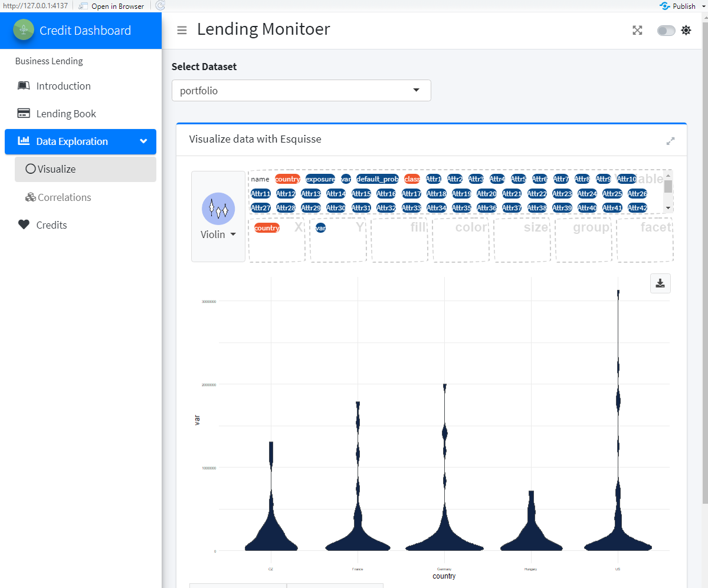

Loan App
================

### Basic Example App

This projects builds a basic business lending shiny app using
[shinyspring](https://shambhu112.github.io/shinyspring/index.html). This
is a motivating example to get to build your first shinyspring app. This
App demonstrates the following features of of shinyspring

1.  Template based code creation
2.  Menu creation in configuration files
3.  Wiring of Datasets
4.  Reuse of pre-built shiny modules
5.  Writing the Core App

This example does not demonstrate other features like *Authentication ,
job scheduling(targets)* and more as they get added.

### Application Context

This app is based on [Bankruptcy
Data](https://www.kaggle.com/fedesoriano/company-bankruptcy-prediction)
of 5000+ companies. the data has been modified slightly so as to enable
a rich demo and case for shinyspring. The datasets for the app can be
found at [link
here](https://github.com/shambhu112/loan_app_basic/tree/master/data)

### Goals and Persona’s

*App Goals*

-   Provide a Lending Risk Monitor Dashboard for a portfolio of loans
    spread across 5 countries.

-   Based on Bankruptcy default probability show the Value at Risk

*Persona Board*

| Persona | Frequency of Visits | Reason to visit and Use | What is Awesome? | What would suck? |
|:-------:|:-------------------:|:-----------------------:|:----------------:|:----------------:|
|         |                     |                         |                  |                  |
|         |                     |                         |                  |                  |
|         |                     |                         |                  |                  |

### Design

### Build Steps

#### Step 1: Create Skeleton App

1.  in R console run `shinyspring::create_new_project()`

2.  open the newly created `user_script.R` . make sure all the
    dependencies are installed as indicated in user\_script

3.  open `config.yml`

4.  Adjust the following properties in config yml.

    Dashboard Look and Feel

        # Dashboard UI information : You should customize
          app_title: Credit Dashboard
          footer_left: Built on Shiny Spring
          footer_left_url: http://www.shinyspring.dev
          footer_right: 2021
          sidebar_expand_onhover: FALSE
          dark_theme: FALSE
          header_href: https://www.shinyspring.dev
          header_image: https://storage.googleapis.com/shiny-pics/spring_logo.png
          header_fixed: 'TRUE'
          title_color: primary
          app_title_h3: Lending Monitoer
          side_bar_fixed: TRUE
          side_bar_header: Business Lending
          header_opacity: 0.8

    Create Menu Structure

        # Menus : You should customize - documentation here $TODO link
        # Note: the ui_function and server_function are from sweetmods or your custom modules
          menus: [
            { title: Introduction , name: intro_tab , icon: leanpub  },
            { title: Lending Book , name: core_tab , icon: credit-card  },
            { title: Data Exploration ,  icon: chart-bar ,  parent_menu: true ,
               sub_menu: [
                 {first:  true ,submenu_title: Visualize , submenu_name: explore_tab , submenu_icon: circle-thin } ,
                 {last_submenu:  true , submenu_title: Correlations , submenu_name: corr_tab , submenu_icon: cubes } ,
               ]
            },
            { title: Credits , name: credits_tab , icon: heart , last_menu: true }
          ]

    For now leave the `explore_tab` and `corr_tab` the way way the are,
    we can adjust them later

5.  Run the rest of the commands in `user_script.r` . You will have a
    new `app.R` . You can run the shiny app in Rstudio or call
    `shiny::runApp()` which will launch the app.

#### Step 2 : Wire Datasets

Wire the Dataset to shinyspring with the following update in config.yml

<!-- -->

    # datsets : This is the approach to pre-load datasets
     ds.portfolio.type: rds
      ds.portfolio.connection: data/portfolio.rds
      ds.portfolio.ds_info_type: google
      ds.portfolio.ds_info_url: https://docs.google.com/spreadsheets/d/17QhXC0b6a0WZGRSFGPA6KBdjq_lalm0TGi33hLBNsFI

<!-- -->

-   Now run the application to see if dataset portolio is loaded
    correctly. You can check based on

    -   *Check 1*: steps 2 to Step 5 in `user_script.R` should run
        without error and the Shiny app should get launched
        :white\_check\_mark:

    -   *Check 2*: When you run the App , you should be able to see the
        the `portfolio` dataset in the drop down in Data Explodation \\
        Visualize Menu . :white\_check\_mark: .

    

Notes: `ds.portfolio.ds_info_type` and `ds.portfolio.ds_info_url` in
config.yml are optional. They perform initial data validation and
provide an opportunity to clean colnames and provide “pretty\_names” to
colums that are easily understood. Please refer to Configuring Datasets
document here \# TODO Link

#### Step 3: Write Core App

1.  Create your custom shiny module needed for Lending Dashboard with
    `shinyspring::create_module("lending_mod")` in R console

2.  open `lending_mod.R` and browse skeleton code

3.  wire the `lending_mod` into the menu’s and application with the
    following changes in `config.yml`

    core\_tab.mod\_name: lending\_mod core\_tab.ui\_function:
    lending\_mod\_ui core\_tab.server\_function: lending\_mod\_server
    core\_tab.onload\_function: lending\_mod\_onLoad

<!-- -->

    the above 4 line items are needed or all modules to talk to shinyspring. For pre-built modules they are defined in package and hence you do not need to wire them explicitly here. Here is the module registry for pre-built modules. Browse these to get an idea how wiring modules to shinyspring. [Link here](https://docs.google.com/spreadsheets/d/15HXspcKqGyDYAM1Jfa7SFjCALHMWTPyTbjrXnWuHY2I/)

1.  Now , let us write the core lending modules. Cut and paste the code
    from here (TODO) in your `lending_mod.R` file

2.  Finally , let us make sure that you source the `lending_mod.R` on
    app startup. Include the following line `source("lending_mod.R")` in
    `on_startup.R` . on\_startup.R was created when you created the
    project.
